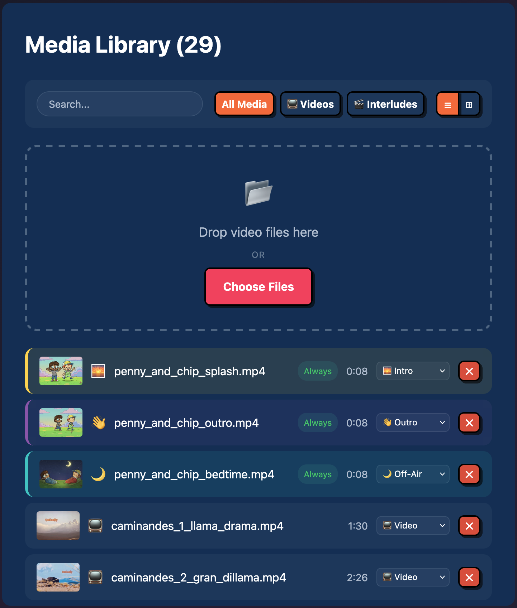
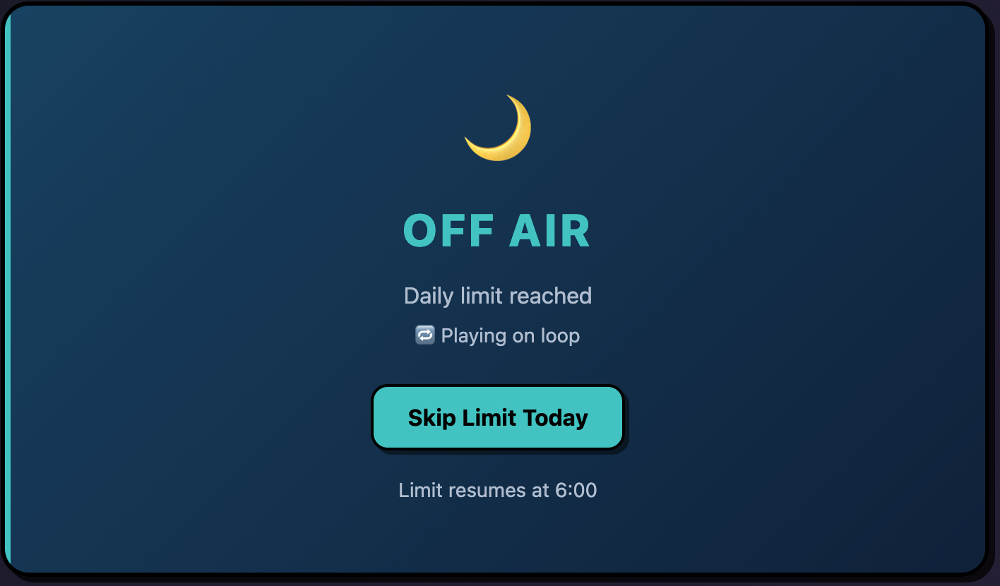
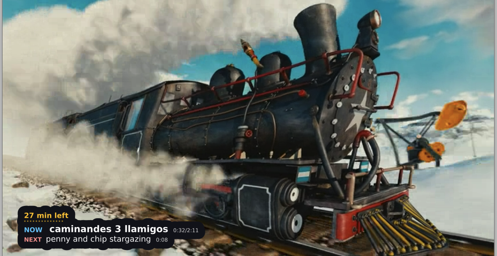

#  ToastTV

**The warm, crispy, 90s TV experience for your Raspberry Pi.**

No more "what should we watch?" — **Turn it on, and the station is already running.**

The anti-algorithm for tired parents and kids who just want to watch cartoons.

> **ToastTV Other fork:** This repository adds a Docker/Unraid headless server,
> managed TV and movie roots, a conservative Kids 7 policy, parent overrides,
> deterministic channel schedules, direct media streaming, and an LG webOS
> client for trusted home-LAN playback.


### Deploy this fork

For Unraid, follow the [Unraid template instructions](#unraid-template). The
template pulls `ghcr.io/itsrammen/toasttv-other:latest` and mounts the TV and
movie shares read-only.

For Docker Desktop on this Windows library:

```powershell
Copy-Item docker-compose.env.example .env
docker compose up -d --build
```

Open the administration UI at `http://127.0.0.1:1993`. The inherited Raspberry
Pi installer at `toasttv.eu` installs the original upstream bare-metal release,
not this Docker/Unraid fork.

Preview the TV client at `http://127.0.0.1:1993/tv/`. To package and sideload it
on an LG TV, follow the [LG webOS client guide](./docs/WEBOS.md).

## Getting Started

The Raspberry Pi playback features below describe the inherited upstream
project. This fork's Docker path provides library administration, schedules,
direct streaming, and a separately packaged LG webOS client.

## Broadcast Control Center

The mobile-first dashboard puts you in the director's chair from any device:

### Library Management
Upload videos, categorize content, and toggle interludes. Videos are automatically checked against your Pi's hardware capabilities. Incompatible files are flagged before they hit the playlist.



### Bedtime Enforcement
One tap to "Sign Off" manually, or set automatic daily limits.



## Why It's Better Than a Playlist

- **Smart Channel Engine**: ToastTV builds a dynamic "Channel" schedule: `[Intro] → [Video] → [Video] → [Interlude] → [Video]`.
- **Screen Time Limits**: Set a daily quota (e.g. 45 mins). When time is up, the station plays the sign-off sequence and stops. No arguments.
- **Seasonal Awareness**: Christmas interludes in December, Spooky bumpers in October. The engine tracks dates automatically—zero config required.
- **Native MPV Power**: Plays MKV, AVI, MP4 directly with hardware acceleration (DRM/KMS). No transcoding, no buffering, rock-solid sync.
- **Living Room Ready**: No keyboard needed. Control playback with your **TV remote** via HDMI-CEC.

### TV Remote Control (HDMI-CEC)

ToastTV listens for HDMI-CEC commands from your TV remote:

| Button | Action |
|--------|--------|
| **SELECT / OK** | Start playback or toggle pause |
| **RIGHT →** | Skip to next video |
| **UP ↑** | Toggle TV guide |
| **PLAY ▶** | Start playback |
| **PAUSE ⏸** | Pause video |

> **Note**: CEC support varies by TV. Arrow keys and SELECT typically work best.

### TV Guide Overlay

Press **UP** on your remote for a retro Now/Next display, see what's playing, what's coming up, and how much screen time is left.



### Starter Content

ToastTV works out of the box. It includes a full "broadcast day" so you can test the flow immediately:

Three episodes of **[Caminandes](https://studio.blender.org/films/caminandes-1/)** (by Blender Studio, CC-BY) are included.

The mascots **Penny & Chip** are ready to run your station.
- **Good morning!** — They sign on together.
- **Bumpers** — They keep the flow moving.
- **Bedtime** — They sign off for the night.
- **Seasonal** — They celebrate holidays together.


## Development

### Docker headless server

The Docker server runs the management application without MPV, HDMI-CEC, or
Raspberry Pi hardware detection. It supports independent read-only TV and
movie roots, a default-deny Kids 7 library, and deterministic channel playback
APIs backed by editable schedules. Seerr/Overseerr is intentionally not part of
this stage.

#### Unraid template

Pushes to `main` publish `linux/amd64` and `linux/arm64` images as
`ghcr.io/itsrammen/toasttv-other:latest`. The published package is public, so
Unraid can pull it anonymously without registry credentials.

To install the repository template manually from an Unraid terminal:

```bash
mkdir -p /boot/config/plugins/dockerMan/templates-user
wget -O /boot/config/plugins/dockerMan/templates-user/my-toasttv-other.xml \
  https://raw.githubusercontent.com/ItsRammen/ToatTV_Other/main/templates/toasttv.xml
```

Then open **Docker → Add Container**, select **ToastTV Other**, and confirm the
defaults:

```text
Appdata: /mnt/user/appdata/toasttv
TV Shows: /mnt/user/Plex/TV Shows (read-only)
Movies:   /mnt/user/Plex/Movies (read-only)
Web UI:   http://TOWER:1993
```

For an existing container created from an earlier template, also verify that
the container targets are exactly `/media/tv` and `/media/movies`, then force an
image update and rescan. If ToastTV reports thousands of indexed files but zero
TV/movie collections, the files were indexed through the old combined
`/media` root and cannot be scheduled as collections. Back up appdata before
discarding an old `media.db`; rebuilding it is the cleanest migration when the
legacy file rows are no longer needed.

The template uses the bundled Kids 7 rating policy. After first start, open
**Settings → Metadata** to save an optional TMDB API key for collection matching
and certification checks; without one, new collections safely remain in
**Needs Review**. The advanced Unraid variables are only first-start bootstrap
defaults. Parent
allow/block overrides, cached metadata, artwork, and the media index persist
beneath appdata. The image serves the browser reference client at `/tv/`; the
same client can be packaged and sideloaded on an LG TV.

For this library on Windows:

```powershell
Copy-Item docker-compose.env.example .env
docker compose up -d --build
```

The example maps `Z:/TV Shows` and `Z:/Movies`. Docker Desktop's WSL backend may
not make mapped SMB drives available to Linux containers even when Windows can
read them. For a library hosted on Unraid, deploying the template directly on
the Unraid server with `/mnt/user/...` paths is the reliable option. The
Compose file requires both host paths and refuses to create a missing source
directory, preventing a typo from appearing as an intentionally empty library.

For another host, set both paths explicitly:

```bash
TOASTTV_TV_PATH=/path/to/tv \
TOASTTV_MOVIE_PATH=/path/to/movies \
TZ=Asia/Taipei \
docker compose up -d --build
```

The admin UI defaults to `http://127.0.0.1:1993`; health status is at
`/api/v1/health`. There is currently no authentication or parent account, so do
not expose this port to the internet or an untrusted network. To reach it from
a trusted home LAN, explicitly set `TOASTTV_BIND_ADDRESS=0.0.0.0` in `.env`.

SQLite, thumbnails, cached artwork, parent overrides, editable channel
definitions, and manual off-air state use the `toasttv-data` Docker volume.
TV, movies, interludes, and policy are separate read-only bind mounts. Back up
the data volume with the container stopped before copying raw SQLite files;
`docker compose down -v` deletes it.

[`config/kids-7.library.json`](./config/kids-7.library.json) defines configurable
rating buckets and local programming groups. Folder entries remain as a legacy
group-assignment source; they are no longer automatic approvals. The default
profile auto-allows `G`, `TV-Y`, `TV-Y7`, and `TV-G`; sends `PG`, `TV-PG`,
unknown, unrated, ambiguous, and provider failures to review; and blocks
`PG-13`, `TV-14`, `R`, `TV-MA`, and `NC-17`. A parent can approve, block, or
return an entire show/movie to policy control, and that decision survives
rescans. Technical probing occurs independently of approval, but only a current
root, valid positive duration, and effective `allow` decision can enter an
automatic schedule.

The policy is intentionally conservative and is loaded once at process start.
Restart the container after editing rating rules or collection-to-group
membership. Compose mounts the repository copy at
`/app/config/kids-7.library.json`; Unraid seeds an editable persistent copy at
`/mnt/user/appdata/toasttv/kids-7.library.json` and reads it through
`/app/data/kids-7.library.json`. Back up that file with appdata. `TZ` controls
container logs and legacy date handling. The policy seeds channel timezones and
slots; after the first channel edit, effective channel definitions come from
`/app/data/channels.json`. If `TOASTTV_LIBRARY_POLICY` is unset,
managed roots boot review-only. If a configured policy is missing, unreadable,
or invalid, ToastTV logs the problem and continues with those roots fail-closed
instead of broadening access.

TMDB enrichment runs separately from filesystem scanning and caches collection
metadata in SQLite. Open **Settings → Metadata** to save the API key, language,
rating region, fallback regions, and request timeout in persistent appdata; the
running provider is updated without restarting. Matching environment variables
remain optional first-start defaults for older Compose and Unraid setups, but a
saved configuration takes precedence. The secret stays server-side and is never
returned by the browser, TV client, or public configuration APIs. A rating-region
order change immediately returns cached certifications to review and refreshes
their retained TMDB matches before automatic playback can resume.

The main `/library` page is collection-first: it summarizes TV shows, movies,
interludes, and collections needing review. TV and movie views support search,
approval and metadata filters, collection-level bulk approve/block actions, and
show pages grouped by season. Raw filenames and probe details remain available
under **Advanced Media Details** and at `/library/files`; they are loaded in
server-filtered pages of at most 100 files and are no longer the primary
approval workflow. Use **Library → Needs Review** to approve, block, or
return a collection to the Kids 7 policy, and **Review → Metadata** to confirm an
ambiguous TMDB result or retry an unmatched collection.

Filesystem scanning and online metadata enrichment are independent background
operations. Their progress is visible in the Library and headless dashboard and
is streamed over the existing dashboard event feed. A new episode joins its
existing show collection and inherits that collection's effective decision;
metadata is not fetched once per episode or on every page load. TMDB poster
files are fetched through a size-restricted server proxy and cached beneath
`/app/data/artwork`.

The scanner preserves catalog rows and parent overrides when a mount cannot be
completely traversed, but quarantines that root from playback until a complete
readable scan succeeds. An individual ffprobe failure gates only that item. A
successfully scanned empty root is treated as intentionally empty and its old
rows are removed. Network-drive change notifications can be unreliable on
Docker Desktop/NAS shares, so use **Rescan** after host changes.

The current schedule endpoints are:

```text
GET /api/v1/channels
GET /api/v1/channels/:id/now
GET /api/v1/channels/:id/guide?hours=8
GET|HEAD /api/v1/channels/:id/live/index.m3u8?clientId=:clientId
GET|HEAD /api/v1/channels/:id/live/segment-:sequence.ts
GET|HEAD /api/v1/media/:id/stream
GET|POST /api/admin/v1/channels
POST /api/admin/v1/channels/auto-build/preview
POST /api/admin/v1/channels/auto-build
PUT|DELETE /api/admin/v1/channels/:id
POST /api/admin/v1/channels/:id/enabled
POST /api/admin/v1/channels/:id/on-air
POST /api/admin/v1/channels/:id/off-air
```

Collection-oriented read APIs are available under `/api/v1/library`; mutating
scan, metadata, approval, and channel controls use `/api/admin/v1`. The current
deployment is still a trusted-LAN MVP: the admin prefix is an API boundary, not
authentication, and TV presence heartbeats are operational telemetry rather
than a trusted identity. Do not expose either interface to the public internet.

The policy seeds Kids Club, Nature & Discovery, and Family Movie Night in the
`Asia/Taipei` timezone. Open **Channels** to create, edit, enable, disable, or
delete channels and configure timezone and schedule slots. **Auto-build a
station** can preview and generate an editable station from playable
collections, TMDB genres, original networks, production studios, or selected
shows/movies. Presets include all playable shows, family animation, movie night,
and a clearly unofficial Nickelodeon-style personal mix. Brand-style presets
filter only the user's parent-allowed local files; they are not affiliated with a
broadcaster and do not reproduce an original or historical network schedule.
The individual selector stays browser-bounded and can search titles, genres,
networks, and studios while retaining already checked collections.
Generated stations can use all-day, before/after-school, evening, or weekend-
morning airtime templates; every generated slot remains editable afterward.

Auto-build persists its exact collection-to-group assignments alongside live
channel definitions and manual off-air state in `/app/data/channels.json`.
Original policy groups remain available, and policy edits still require a
restart. Existing matched TMDB collections are queued once for direct metadata
refresh after the network/studio schema migration, preserving locked matches
and parent overrides. Edits and generated stations otherwise take effect
without restarting the server.
Timelines are deterministic across restarts and return the current media ID,
start/end timestamps, live offset, item type, source range, transitions, a
direct fallback URL, and one stable channel HLS URL. Enabled interludes are
scheduled at their measured durations between whole programs according to the
saved frequency setting, so **Now** and **Next** include bumpers honestly. The
guide includes `requestedEnd`, `coverageEnd`, and `truncated` so an extreme
short-clip schedule cannot silently exceed the bounded response size. The stream
worker starts on the first viewer, is shared by every viewer on that channel,
normalizes mixed inputs to H.264/AAC, and stops after its viewer leases expire
and the configured warm-idle period completes. The dashboard reports logical
on-air state and physical FFmpeg worker state separately. Direct-file fallback
still supports HTTP Range requests for seeking. **Go off air** only
pauses a valid schedule. An enabled channel with no eligible items is shown as
**No programming** and links to its configuration instead of offering a false
"Go on air" remedy.

`/api/v1/health` currently checks SQLite and FFmpeg only. It does not prove the
mounts are readable or that the first scan finished. Watch the Dashboard or
Library scan card until discovery/probing completes, then open **Library → Needs
Review** and verify metadata/approval decisions before relying on a schedule.
Use `docker compose logs -f toasttv` as the troubleshooting fallback.

Docker Compose defaults to UID/GID `1000`; the image also accepts numeric
`PUID`/`PGID` overrides. A host or NAS media bind mount must grant the selected
identity (or a supplemental group) read access to files and traverse access to
directories. `group_add` applies to Linux/Unraid; Docker Desktop uses Windows
share permissions and Docker file sharing.

```yaml
services:
  toasttv:
    group_add: ["1234"] # numeric GID allowed to read/traverse the media share
```

The provided Unraid template maps appdata to `/app/data`, maps both media roots
read-only, and runs the server as Unraid's normal `PUID=99` / `PGID=100`.
Override those advanced fields if your share permissions use another identity.
Stop the container while an appdata backup copies the SQLite database.

Docker deliberately disables legacy local playback controls. The webOS client
now stays attached to the channel's stable HLS URL across episode and bumper
boundaries, while retaining direct-file playback as an error fallback. See
[`docs/WEBOS.md`](./docs/WEBOS.md) for browser preview, packaging, sideloading,
and codec-compatibility guidance.

**TMDB attribution:**

<a href="https://www.themoviedb.org"></a>

This product uses the TMDB API but is not endorsed or certified by TMDB.

```bash
make install   # Install Bun, MPV, FFmpeg
make start     # Start MPV + server
make dev       # Start with watch mode
make test      # Run tests
```

### Testing Different Hardware Profiles

Force a specific Pi profile to test media compatibility:

```bash
make start PROFILE=pi-zero-2w   # Test as Pi Zero 2 W (limited)
make start PROFILE=pi-4         # Test as Pi 4 (full capability)
make dev PROFILE=pi-zero-2w     # Dev mode with profile
```

Available profiles: `pi-zero-2w`, `pi-3`, `pi-4`, `pi-5`, `unknown`

### RPi Simulator Testing

Test the install flow locally using a Raspberry Pi VM (or any ARM64 VM):

```bash
# On your computer: start the dev server
make serve-local

# In the VM: curl install from your computer
curl -fsSL http://<computer-ip>:3000/install.sh | sudo LOCAL_SERVER=http://<computer-ip>:3000 bash
```

This builds a fresh tarball and serves it via a local HTTP server that mocks GitHub release endpoints.

### TV Simulation (Black-Box Testing)

For testing detection in a VM without real hardware:

```bash
# Deploy mock scripts to VM (one-time)
TVSIM_HOST=dietpi@192.168.x.x make tvsim

# On VM: simulate TV events
./tv-sim.sh on          # TV power on
./tv-sim.sh off         # TV standby
./tv-sim.sh guide       # Toggle TV guide
./tv-sim.sh hdmi-plug   # HDMI cable connected
./tv-sim.sh hdmi-unplug # HDMI disconnected
./tv-sim.sh status      # Show current state
```

### Tech Stack

See [ARCHITECTURE.md](./ARCHITECTURE.md) for tech stack, and design decisions.

## License

MIT
